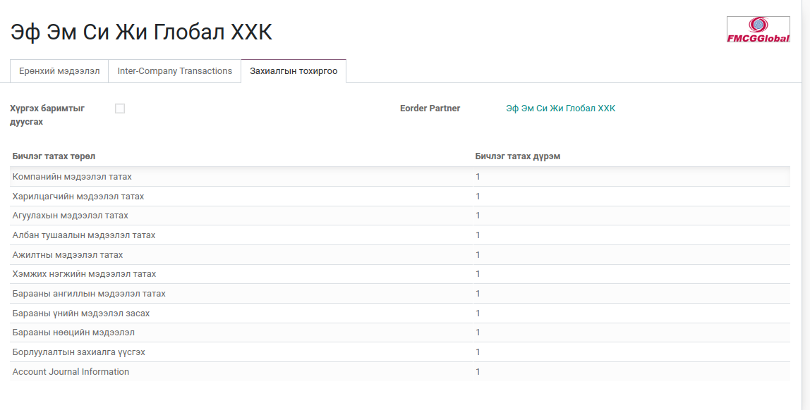

# EOrder борлуулалтын сервис

`POST: http://dev13db.bumanerp.mn/eorder` 

### Агуулга

`bumanit_eorder_webservice` модульд хүсэлтийн хүлээн авах controller байна.

### ERP тохиргоо

1. Компани мэдээлэл дорорх Захиалгын тохиргоо таб дээр шаардлагатай ашиглах сервисүүдийг оруулж өгнө
   1. Eorder Partner гэсэн талбар дээр компанийн өөрсдийн ерп дээр бүртгэлтэй харилцагчийг сонгож өгнө.
    

2. Системийн параметрээс mercur.connection гэсэн түлхүүр үгээр хайгаад ерп дээр бүртгэлтэй админ эрх бүхий хэрэглэгчийн ID г оруулж өгнө
    1. {2:3} Жишээ нь 2 бол портол хэрэглэгч 3 бол админ хэрэглэгч. Сервис ашиглаж байгаа гадны компани дээр портал хэрэглэгчийн нэвтрэх нэр нууц үг өгөх бөгөөд ЕРП дээр хандалт орж ирэхэд админ хэрэглэгчээр систем ажиллана.
        
   
### Сервисүүд

1.  [`Компанийн мэдээлэл татах`](./eorder_company_info)
2.  [`Харилцагчийн мэдээлэл татах`](./eorder_partner_info)
3.  [`Агуулахын мэдээлэл татах`](./eorder_warehouse_info)
4.  [`Албан тушаалын мэдээлэл татах`](./eorder_job_info)
5.  [`Ажилтны мэдээлэл татах`](./eorder_employee_info)
6.  [`Хэмжих нэгжийн мэдээлэл татах`](./eorder_uom_info)
7.  [`Барааны ангиллын мэдээлэл татах`](./eorder_prodict_category_info)
8.  [`Барааны нөөцийн мэдээлэл`](./eorder_stock_info)
9.  [`Борлуулалтын захиалга үүсгэх`](./eorder_create)

