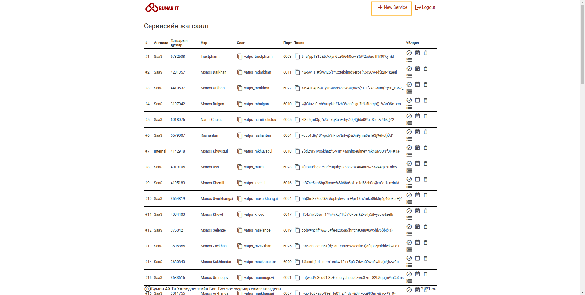
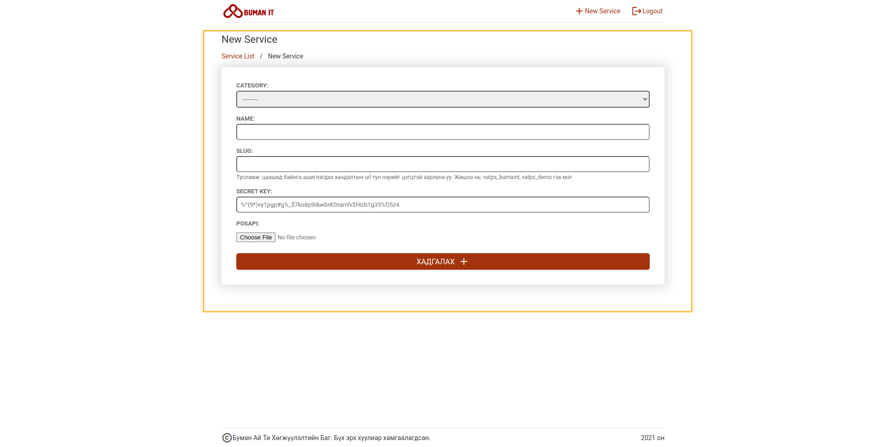
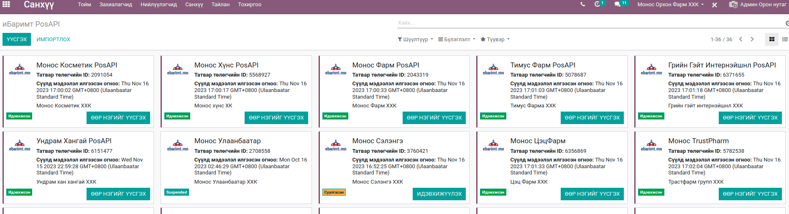
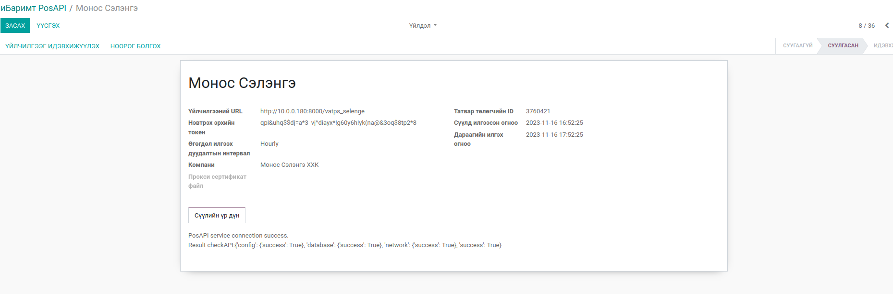

# Борлуулалтын Ебаримтын тохиргоо

### Тохиргоо

1. https://ebarimt.bumanerp.mn домайнаар нэвтэрч орно.
2. New service товч дээр дарж шинэ сервис үүсгэнэ.
    
3. Талбаруудыг өмнөх бүртгэсэн сервисийн нэртэй давхцахгүйгээр үүсгэнэ.
    
    1. Category - Тохилруулж буй сервисийн ангилал
       1. Internal - Дотоод компани
       2. SaaS - Гадны төслийн компани
       3. Demo - Тестийн посапи
    2. Name - Тухайн пос апи тохируулж буй компанийн нэр
    3. Slug - Энэ талбар дээр өмнө нй бүртгэгдсэн посапи слагтай давхцахгүй үүсгэх бөгөөд `vatps_` ийн залгаад богино бөгөөд латинаар шинэ слаг үүсгэнэ Жишээ нь (vatps_monos,vatps_fmcg)
    4. SECRET KEY - Энэ талбар дээр байгаа утга автоматаар үүсдэг бөгөөд ЕРП тай холбогдох түлхүүр үг болно.
    5. POSAPI: Захиалсан posapi zip файл оруулж өгнө.
    6. Үүний дараа ерп дээр тохиргоо хийнэ.
   
### ЕРП тохиргоо

1. Санхүү модулийн -> тохиргоо -> иБаримт PosAPI 
   
2. Бүртгэх
   
   1. Үйлчилгээний URL дээр https://ebarimt.bumanerp.mn/ залгаад вэб дээр тохируулсан компанийн слаг бүртгэнэ. Жишээ нь (https://ebarimt.bumanerp.mn/vatps_selenge)
   2. Нэвтрэх эрхийн токен дээр вэб дээр тохируулсан компанийн Токенийг хуулж тавина.
   3. Компанийн мэдээлэл дээр татварын дугаарыг тохируулсан байх ёстой.
   4. Идэвхжүүлэх товч дарснаар "Сүүлийн үр дүн" гэсэн талбарт 
   
        PosAPI service connection success.
        Result checkAPI:{'config': {'success': True}, 'database': {'success': True}, 'network': {'success': True}, 'success': True}
    хариу ирсэн тохиолдолд тохиргоо дуусна.