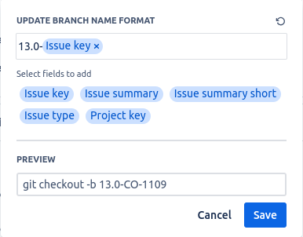

# Code Reviews

<aside>
💡 This template documents how to review code. Helpful for new and remote employees to get and stay aligned.

</aside>

# Philosophy

Why do you perform code reviews? What are your guiding principles for these reviews?

You may want to mention other pages here. Like Engineering Guidelines. To link to another page inline, type `@` followed by the name of the page: [Engineering Guidelines](https://www.notion.so/Engineering-Guidelines-a174171163834cf596943cf14edd67bc)

# Preparing Code for Review

Preparation sets your reviewers up for success.

### Branch Name

Create branch name standard: [Version]-[Jira issue key]



Example: `17.0-CO-1000`

### Commit Messages

Make sure your commit messages are descriptive.

### Github PR Descriptions

Your PR descriptions should be an extension of your commit messages. Write about both what the commit changes, and how you implemented the change.

```code

# Pull request-н тайлбар
Description of the issue/feature this PR addresses:

# Одоо байгаа төлөв
Current behavior before PR:

# Хүрэх үр дүн
Desired behavior after PR is merged:

--
```

# Performing Code Reviews

### How to Review

- Make two passes over the PR if it's substantial.
  - On the first pass, come to an understanding of the code change at a high level.
  - On the second pass, pay more attention to semantic details.

# Standarts

### XML inherit view and declare id and name

- id: `inherit_view_id`\_inherit\_`module_name`
- name: `inherit_view_id`\.inherit\.`module_name`

```code title="Example"
<record id="view_account_move_inherit_bumanit_account_online_sync" model="ir.ui.view">
    <field name="name">view_account_move.inherit.bumanit_account_online_sync</field>
    <field name="model">account.move</field>
    <field name="inherit_id" ref="account.view_move_form" />
    <field name="arch" type="xml">
        ...
    </field>
</record>
```

### XML create view and declare id and name

- id: view\_`model`\_`[form|tree|kanban|etc...]`
- name: view.`model`\.`[form|tree|kanban|etc...]`

```code title="Example"
<record id="view_account_move_form" model="ir.ui.view">
    <field name="name">view.account.move.form</field>
    <field name="model">account.move</field>
    <field name="arch" type="xml">
        ...
    </field>
</record>
```

### XML create action and declare id and name

- id: action\_`model`\_`[form|tree|kanban|etc...]`
- name: action.`model`\.`[form|tree|kanban|etc...]`

```code title="Example"
<record id="action_account_move_form" model="ir.actions.act_window">
    <field name="name">action.account.move.form</field>
    <field name="model">account.move</field>
    ...
</record>
```
