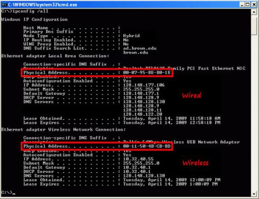

## Windows

1. `Start` товч дээр дарна.
2. Хайх цонх дээр `cmd` гэж оруулснаар комманд оруулах тернинал гарч ирнэ.
3. ```code title="Mac address харах комманд"
   ipconfig /all
   ```
   
4. Доорх 2 холболтоос **Physical Address** хайн илгээнэ.
   1. **Ethernet adapter Local Area Connection**
   2. **Ethernet adapter Wireless Network Connection**
