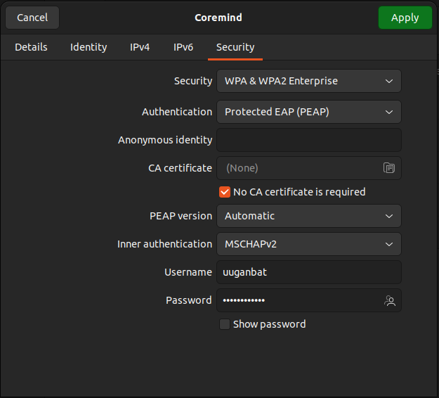

Коормайнд компаний хамт олонд тавтай морил.

## Шаардлагатай зүйлсийн жагсаалт

- Нөүтбүүк
  - Үйлдлийн систем шинээр суулгаж тохируулах
- Ширээ бэлдэх
- [Имэйл хаяг](https://webmail.monos.mn) (Компаниас нээж өгнө)
- Wifi Configuration (Username: email, Password: email password).
- [ИРП](https://bumanerp.mn) эрх нээх (Компаниас нээж өгнө)
- [Slack](https://join.slack.com/t/coremindworkspace/shared_invite/zt-22q1t9jdt-2dYw6pjrWjjnFfAM1VF1XQ) эрх нээх
- [Github](https://github.com/) эрх нээх
- [Jira](https://coremind.atlassian.net/jira/projects) эрх нээх
- [Pgadmin](https://pgadmin.bumanerp.mn) эрх нээх (Компаниас нээж өгнө)

## Системүүдэд бүртгүүлэх стандартууд

- Github хаяг нээх заавар
  - Ажлын имэйлээр шинэ хаяг нээх
  - Дэлгэцийн нэр **Нэр ОВОГ** байдлаар тохируулах (Жишээ нь: Ууганбат БАТ-ЭРДЭНЭ)
- Slack хаяг нээх заавар
  - Дэлгэцийн нэр **Нэр ОВОГ** байдлаар тохируулах (Жишээ нь: Ууганбат БАТ-ЭРДЭНЭ)

## Ubuntu үйлдлийн систем дээрээс Coremind wifi уруу орох заавар

